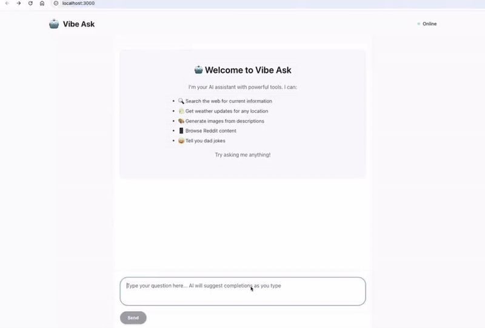

# VibeAsk AI Agent
An AI-powered chat application with real-time contextual suggestion and custom tools, built with Node.js, React, and SSE.

## Features
- Interactive Chat UI – React-based interface for smooth AI conversations
- SSE-powered Auto-Completion – Real-time question prediction while typing
- Custom AI Tools – Includes image generation, weather lookup, and more
- Node.js LLM Backend – Handles conversation flow and tool integration

## Tech Stack
- Frontend: React, CSS
- Backend: Node.js, Express
- Real-Time: Server-Sent Events (SSE)
- AI Model: GPT-4o (OpenAI API)

## Demo

